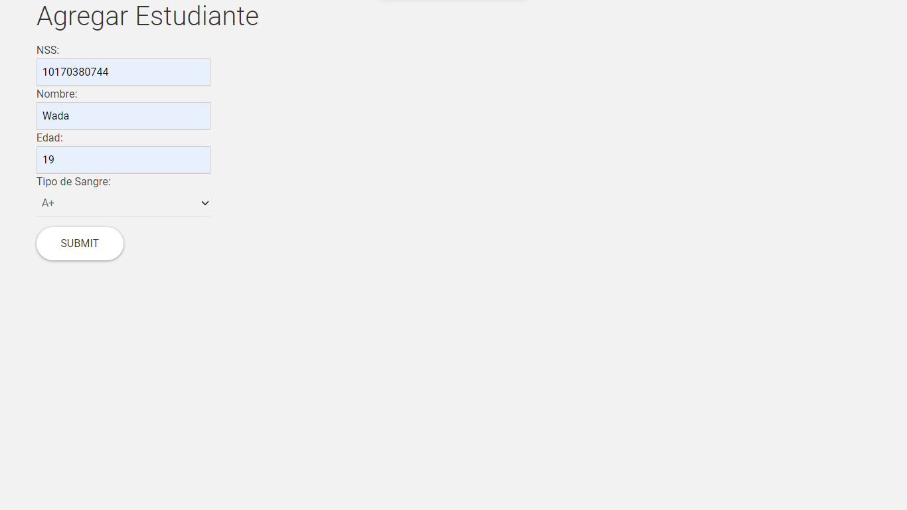

# Práctica 15: Peticiones por POST

<h2 align="center">POST REQUESTS</h2>

En la práctica anterior abordamos el tema del Querystring y las peticiones GET, ahora es turno de las peticiones POST.
Cuando la petición es mediante el método POST, el query string es “movido” hacia el “body” y para acceder a su contenido es necesario “parsear” el contenido del “Body” de la petición y obtener la información. La información que “viaja” durante la petición, puede ser en formato de texto o en formato JSON, dependiendo de la necesidad.
Para “sacar” la información del “body”, debemos instalar un “middleware” que nos permita extraer su contenido, ya sea en formato de texto o en formato JSON. Para lograr ese
objetivo, instalaremos el paquete “bodyparser” desde la línea de comando

## Vistazos de ejecución
### _Menú Principal_

### _Respuesta_

