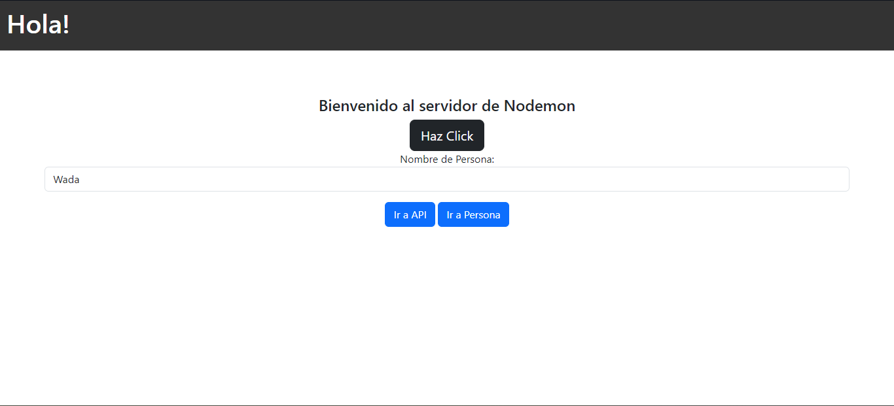

# Práctica 12: View Engines

## Información Previa

Una forma de enviar información que se genera en los “route handlers” de nuestra app, hacia el “front end” es mediante un template engine. Express permite “conectar” una cantidad considerable de “templates engines” a nuestra aplicación de Express.
Uno de los “template engines” más populares es “EJS”.

