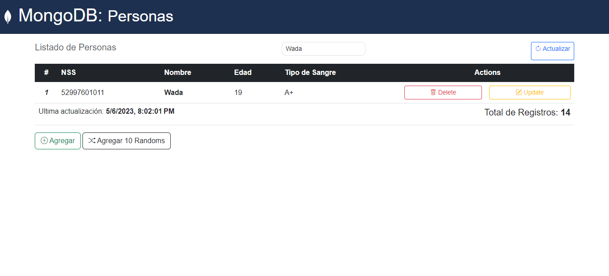
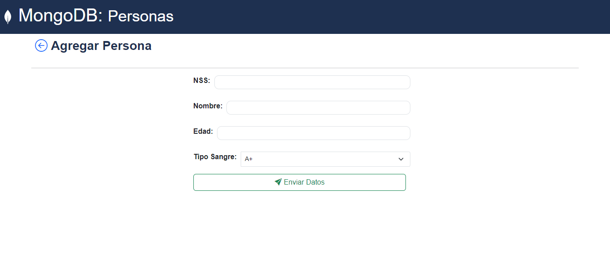
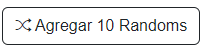

# Práctica 21: Editar un documento a la colección de MongoDB


*Imagen Ilustrativa*

En esta práctica, utilizaremos una parte del código de la práctica anterior y necesitaremos la base de datos de MongoDB creada en la sesión anterior con documentos insertados:

## Instrucciones

- Utilizaremos TODO el código de la práctica anterior y agregaremos 2 nuevos
endpoints, uno por GET para mostrar el formulario donde se edita un nuevo
documento y otro por POST para actualizar el documento en la colección

### Schema MongoDB: Persons

```
nombre: String,
edad: Number,
tipoSangre: String,
nss: String
```

# Práctica 21 (Versión P21.2)

En esta nueva versión se incorporan nuevas funcionalidades y refactorizaciones en el código:

### Funcionalidades

- Cambios en el funcionamiento de la ruta `update`
- Funcionalidad para buscar datos en la tabla
- Visibilidad de la `Última Actualización de Datos`
- Nuevo botón: `Agregar Randoms`, agrega 10 personas a la database

### Características

- Nuevos Estilos
  - Implementación de Bootstrap 5
  - Rediseño y refactorización en la interfaz
  - Nuevo color en la etiqueta `pre` que se muestra en la modal de eliminar
- Nuevos Iconos
  - Implementación de iconos pertenecientes a Bootstrap 5
  - Uso de `svg` para el ícono de MongoDb

### Problemas Resueltos

- Error que se encontraba en los headers de la tabla del archivo `person.ejs`
-Ajuste en el tiempo en el que se muestra la modal de eliminación

# Vista Previa


*Database*: Datos usados en la colección de MongoDB



*Buscar*: Dependiendo lo que ingrese en el campo, se mostrara una fila en la tabla con dicho contenido



*Agregar*: Interfaz para agregar nuevas personas a la colección



*Random*: Se agregan 10 personas con datos randoms

*Modificar*: Interfaz para editar los datos


*Eliminar*: Modal de eliminación
