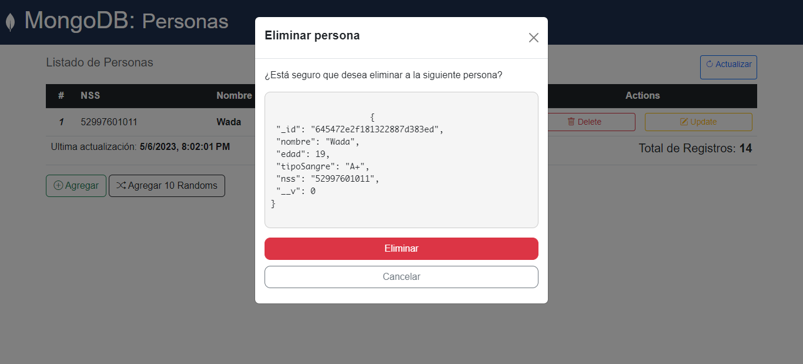

# Práctica 21: Editar un documento a la colección de MongoDB


*Imagen Ilustrativa*

En esta práctica, utilizaremos una parte del código de la práctica anterior y necesitaremos la base de datos de MongoDB creada en la sesión anterior con documentos insertados:

## Instrucciones:

- Utilizaremos TODO el código de la práctica anterior y agregaremos 2 nuevos
endpoints, uno por GET para mostrar el formulario donde se edita un nuevo
documento y otro por POST para actualizar el documento en la colección

### Schema MongoDB: Persons
```
nombre: String,
edad: Number,
tipoSangre: String,
nss: String
```
# Vista Previa

*Database*: Datos usados en la colección de MongoDB


*Agregar*: Interfaz para agregar nuevas personas a la colección


*Modificar*: Interfaz para editar los datos


*Eliminar*: Modal de eliminación